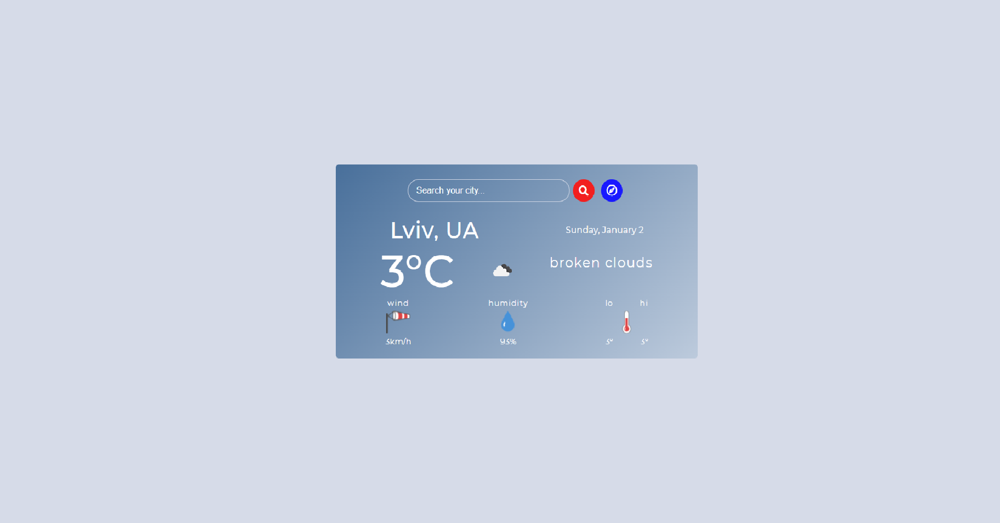
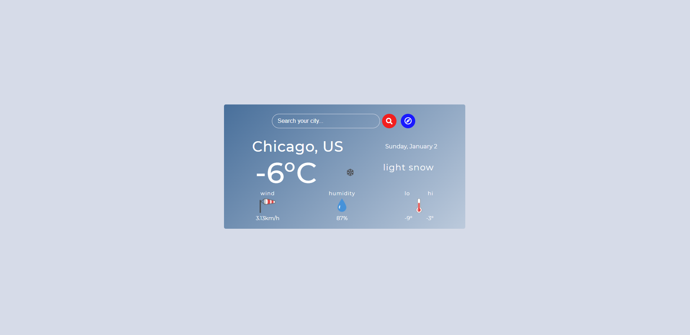

<div align='center'>
  <h1>Weather App</h1>
  
</div>

> Node.js - Built with the [Open Weather API](https://openweathermap.org/api)

_A simple weather app that allows you to get current weather information, based on the city you enter and your current position._

---

<h2><a href=''>Live demo</a></h2>




---

### Technologies

- HTML, CSS, JavaScript
- NodeJS
- Ejs
- Express.js
- Node-fetch
- Node-navigator

---

### How To Use

_To clone and run this application, you'll need Git, [Node.js v13.14.0][nodejs] or higher + [Npm v6.14.15][npm] or higher installed on your computer. From your command line:_

```js
  // Clone this repository
  $ https://github.com/DidykS/weather-node-js-app.git

  // Go into the repository
  $ cd weather-node-js-app

  // Install dependencies for the frontend and run the server
  $ npm install
  $ npm start
```
